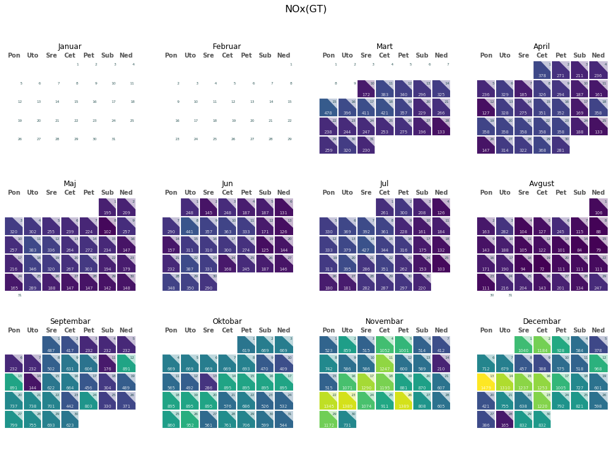

# Projekat iz predmeta Analiza velikih podataka, Raf 2021

### Student: Aleksandar Gavric M2020, Mentor: Prof. Snezana Popovic

Analiza podataka o zagadjenju vazduha - posmatranje sezonalnosti zagadjenja razlicitih zagadjivaca i atmosferskih velicina i prediktovanje nivo CO2 na osnovu atmosferskih karakteristika. Dobijenim rezultatima je moguce ustedeti postavljanje senzora za merenje zagadjenja koji su visoko korelisani sa ostalim senzorima koji bi se postavili. 

## Analiza skupova podataka

#### Ucitavanje podataka


```python
import pandas as pd

# http://archive.ics.uci.edu/ml/datasets/Air+Quality
df_AirQuality_UCI = pd.read_csv("datasets/AirQualityUCI.csv", sep=';', decimal=',')

# http://archive.ics.uci.edu/ml/datasets/PM2.5+Data+of+Five+Chinese+Cities
df_Beijing = pd.read_csv("datasets/BeijingPM20100101_20151231.csv")
#df_Chengdu = pd.read_csv("datasets/ChengduPM20100101_20151231.csv")
#df_Guangzhou = pd.read_csv("datasets/GuangzhouPM20100101_20151231.csv")
#df_Shanghai = pd.read_csv("datasets/ShanghaiPM20100101_20151231.csv")
#df_Shenyang = pd.read_csv("datasets/ShenyangPM20100101_20151231.csv")
```


```python
df_AirQuality_UCI
```


<div>
<style scoped>
    .dataframe tbody tr th:only-of-type {
        vertical-align: middle;
    }

    .dataframe tbody tr th {
        vertical-align: top;
    }

    .dataframe thead th {
        text-align: right;
    }
</style>
<table border="1" class="dataframe">
  <thead>
    <tr style="text-align: right;">
      <th></th>
      <th>Date</th>
      <th>Time</th>
      <th>CO(GT)</th>
      <th>PT08.S1(CO)</th>
      <th>NMHC(GT)</th>
      <th>C6H6(GT)</th>
      <th>PT08.S2(NMHC)</th>
      <th>NOx(GT)</th>
      <th>PT08.S3(NOx)</th>
      <th>NO2(GT)</th>
      <th>PT08.S4(NO2)</th>
      <th>PT08.S5(O3)</th>
      <th>T</th>
      <th>RH</th>
      <th>AH</th>
      <th>Unnamed: 15</th>
      <th>Unnamed: 16</th>
    </tr>
  </thead>
  <tbody>
    <tr>
      <td>0</td>
      <td>10/03/2004</td>
      <td>18.00.00</td>
      <td>2.6</td>
      <td>1360.0</td>
      <td>150.0</td>
      <td>11.9</td>
      <td>1046.0</td>
      <td>166.0</td>
      <td>1056.0</td>
      <td>113.0</td>
      <td>1692.0</td>
      <td>1268.0</td>
      <td>13.6</td>
      <td>48.9</td>
      <td>0.7578</td>
      <td>NaN</td>
      <td>NaN</td>
    </tr>
    <tr>
      <td>1</td>
      <td>10/03/2004</td>
      <td>19.00.00</td>
      <td>2.0</td>
      <td>1292.0</td>
      <td>112.0</td>
      <td>9.4</td>
      <td>955.0</td>
      <td>103.0</td>
      <td>1174.0</td>
      <td>92.0</td>
      <td>1559.0</td>
      <td>972.0</td>
      <td>13.3</td>
      <td>47.7</td>
      <td>0.7255</td>
      <td>NaN</td>
      <td>NaN</td>
    </tr>
    <tr>
      <td>2</td>
      <td>10/03/2004</td>
      <td>20.00.00</td>
      <td>2.2</td>
      <td>1402.0</td>
      <td>88.0</td>
      <td>9.0</td>
      <td>939.0</td>
      <td>131.0</td>
      <td>1140.0</td>
      <td>114.0</td>
      <td>1555.0</td>
      <td>1074.0</td>
      <td>11.9</td>
      <td>54.0</td>
      <td>0.7502</td>
      <td>NaN</td>
      <td>NaN</td>
    </tr>
    <tr>
      <td>3</td>
      <td>10/03/2004</td>
      <td>21.00.00</td>
      <td>2.2</td>
      <td>1376.0</td>
      <td>80.0</td>
      <td>9.2</td>
      <td>948.0</td>
      <td>172.0</td>
      <td>1092.0</td>
      <td>122.0</td>
      <td>1584.0</td>
      <td>1203.0</td>
      <td>11.0</td>
      <td>60.0</td>
      <td>0.7867</td>
      <td>NaN</td>
      <td>NaN</td>
    </tr>
    <tr>
      <td>4</td>
      <td>10/03/2004</td>
      <td>22.00.00</td>
      <td>1.6</td>
      <td>1272.0</td>
      <td>51.0</td>
      <td>6.5</td>
      <td>836.0</td>
      <td>131.0</td>
      <td>1205.0</td>
      <td>116.0</td>
      <td>1490.0</td>
      <td>1110.0</td>
      <td>11.2</td>
      <td>59.6</td>
      <td>0.7888</td>
      <td>NaN</td>
      <td>NaN</td>
    </tr>
    <tr>
      <td>...</td>
      <td>...</td>
      <td>...</td>
      <td>...</td>
      <td>...</td>
      <td>...</td>
      <td>...</td>
      <td>...</td>
      <td>...</td>
      <td>...</td>
      <td>...</td>
      <td>...</td>
      <td>...</td>
      <td>...</td>
      <td>...</td>
      <td>...</td>
      <td>...</td>
      <td>...</td>
    </tr>
    <tr>
      <td>9466</td>
      <td>NaN</td>
      <td>NaN</td>
      <td>NaN</td>
      <td>NaN</td>
      <td>NaN</td>
      <td>NaN</td>
      <td>NaN</td>
      <td>NaN</td>
      <td>NaN</td>
      <td>NaN</td>
      <td>NaN</td>
      <td>NaN</td>
      <td>NaN</td>
      <td>NaN</td>
      <td>NaN</td>
      <td>NaN</td>
      <td>NaN</td>
    </tr>
    <tr>
      <td>9467</td>
      <td>NaN</td>
      <td>NaN</td>
      <td>NaN</td>
      <td>NaN</td>
      <td>NaN</td>
      <td>NaN</td>
      <td>NaN</td>
      <td>NaN</td>
      <td>NaN</td>
      <td>NaN</td>
      <td>NaN</td>
      <td>NaN</td>
      <td>NaN</td>
      <td>NaN</td>
      <td>NaN</td>
      <td>NaN</td>
      <td>NaN</td>
    </tr>
    <tr>
      <td>9468</td>
      <td>NaN</td>
      <td>NaN</td>
      <td>NaN</td>
      <td>NaN</td>
      <td>NaN</td>
      <td>NaN</td>
      <td>NaN</td>
      <td>NaN</td>
      <td>NaN</td>
      <td>NaN</td>
      <td>NaN</td>
      <td>NaN</td>
      <td>NaN</td>
      <td>NaN</td>
      <td>NaN</td>
      <td>NaN</td>
      <td>NaN</td>
    </tr>
    <tr>
      <td>9469</td>
      <td>NaN</td>
      <td>NaN</td>
      <td>NaN</td>
      <td>NaN</td>
      <td>NaN</td>
      <td>NaN</td>
      <td>NaN</td>
      <td>NaN</td>
      <td>NaN</td>
      <td>NaN</td>
      <td>NaN</td>
      <td>NaN</td>
      <td>NaN</td>
      <td>NaN</td>
      <td>NaN</td>
      <td>NaN</td>
      <td>NaN</td>
    </tr>
    <tr>
      <td>9470</td>
      <td>NaN</td>
      <td>NaN</td>
      <td>NaN</td>
      <td>NaN</td>
      <td>NaN</td>
      <td>NaN</td>
      <td>NaN</td>
      <td>NaN</td>
      <td>NaN</td>
      <td>NaN</td>
      <td>NaN</td>
      <td>NaN</td>
      <td>NaN</td>
      <td>NaN</td>
      <td>NaN</td>
      <td>NaN</td>
      <td>NaN</td>
    </tr>
  </tbody>
</table>
<p>9471 rows × 17 columns</p>
</div>


```python
df_Beijing
```


<div>
<style scoped>
    .dataframe tbody tr th:only-of-type {
        vertical-align: middle;
    }

    .dataframe tbody tr th {
        vertical-align: top;
    }

    .dataframe thead th {
        text-align: right;
    }
</style>
<table border="1" class="dataframe">
  <thead>
    <tr style="text-align: right;">
      <th></th>
      <th>No</th>
      <th>year</th>
      <th>month</th>
      <th>day</th>
      <th>hour</th>
      <th>season</th>
      <th>PM_Dongsi</th>
      <th>PM_Dongsihuan</th>
      <th>PM_Nongzhanguan</th>
      <th>PM_US Post</th>
      <th>DEWP</th>
      <th>HUMI</th>
      <th>PRES</th>
      <th>TEMP</th>
      <th>cbwd</th>
      <th>Iws</th>
      <th>precipitation</th>
      <th>Iprec</th>
    </tr>
  </thead>
  <tbody>
    <tr>
      <td>0</td>
      <td>1</td>
      <td>2010</td>
      <td>1</td>
      <td>1</td>
      <td>0</td>
      <td>4</td>
      <td>NaN</td>
      <td>NaN</td>
      <td>NaN</td>
      <td>NaN</td>
      <td>-21.0</td>
      <td>43.0</td>
      <td>1021.0</td>
      <td>-11.0</td>
      <td>NW</td>
      <td>1.79</td>
      <td>0.0</td>
      <td>0.0</td>
    </tr>
    <tr>
      <td>1</td>
      <td>2</td>
      <td>2010</td>
      <td>1</td>
      <td>1</td>
      <td>1</td>
      <td>4</td>
      <td>NaN</td>
      <td>NaN</td>
      <td>NaN</td>
      <td>NaN</td>
      <td>-21.0</td>
      <td>47.0</td>
      <td>1020.0</td>
      <td>-12.0</td>
      <td>NW</td>
      <td>4.92</td>
      <td>0.0</td>
      <td>0.0</td>
    </tr>
    <tr>
      <td>2</td>
      <td>3</td>
      <td>2010</td>
      <td>1</td>
      <td>1</td>
      <td>2</td>
      <td>4</td>
      <td>NaN</td>
      <td>NaN</td>
      <td>NaN</td>
      <td>NaN</td>
      <td>-21.0</td>
      <td>43.0</td>
      <td>1019.0</td>
      <td>-11.0</td>
      <td>NW</td>
      <td>6.71</td>
      <td>0.0</td>
      <td>0.0</td>
    </tr>
    <tr>
      <td>3</td>
      <td>4</td>
      <td>2010</td>
      <td>1</td>
      <td>1</td>
      <td>3</td>
      <td>4</td>
      <td>NaN</td>
      <td>NaN</td>
      <td>NaN</td>
      <td>NaN</td>
      <td>-21.0</td>
      <td>55.0</td>
      <td>1019.0</td>
      <td>-14.0</td>
      <td>NW</td>
      <td>9.84</td>
      <td>0.0</td>
      <td>0.0</td>
    </tr>
    <tr>
      <td>4</td>
      <td>5</td>
      <td>2010</td>
      <td>1</td>
      <td>1</td>
      <td>4</td>
      <td>4</td>
      <td>NaN</td>
      <td>NaN</td>
      <td>NaN</td>
      <td>NaN</td>
      <td>-20.0</td>
      <td>51.0</td>
      <td>1018.0</td>
      <td>-12.0</td>
      <td>NW</td>
      <td>12.97</td>
      <td>0.0</td>
      <td>0.0</td>
    </tr>
    <tr>
      <td>...</td>
      <td>...</td>
      <td>...</td>
      <td>...</td>
      <td>...</td>
      <td>...</td>
      <td>...</td>
      <td>...</td>
      <td>...</td>
      <td>...</td>
      <td>...</td>
      <td>...</td>
      <td>...</td>
      <td>...</td>
      <td>...</td>
      <td>...</td>
      <td>...</td>
      <td>...</td>
      <td>...</td>
    </tr>
    <tr>
      <td>52579</td>
      <td>52580</td>
      <td>2015</td>
      <td>12</td>
      <td>31</td>
      <td>19</td>
      <td>4</td>
      <td>140.0</td>
      <td>157.0</td>
      <td>122.0</td>
      <td>133.0</td>
      <td>-8.0</td>
      <td>68.0</td>
      <td>1031.0</td>
      <td>-3.0</td>
      <td>SE</td>
      <td>7.14</td>
      <td>0.0</td>
      <td>0.0</td>
    </tr>
    <tr>
      <td>52580</td>
      <td>52581</td>
      <td>2015</td>
      <td>12</td>
      <td>31</td>
      <td>20</td>
      <td>4</td>
      <td>157.0</td>
      <td>199.0</td>
      <td>149.0</td>
      <td>169.0</td>
      <td>-8.0</td>
      <td>63.0</td>
      <td>1030.0</td>
      <td>-2.0</td>
      <td>SE</td>
      <td>8.03</td>
      <td>0.0</td>
      <td>0.0</td>
    </tr>
    <tr>
      <td>52581</td>
      <td>52582</td>
      <td>2015</td>
      <td>12</td>
      <td>31</td>
      <td>21</td>
      <td>4</td>
      <td>171.0</td>
      <td>231.0</td>
      <td>196.0</td>
      <td>203.0</td>
      <td>-10.0</td>
      <td>73.0</td>
      <td>1030.0</td>
      <td>-6.0</td>
      <td>NE</td>
      <td>0.89</td>
      <td>0.0</td>
      <td>0.0</td>
    </tr>
    <tr>
      <td>52582</td>
      <td>52583</td>
      <td>2015</td>
      <td>12</td>
      <td>31</td>
      <td>22</td>
      <td>4</td>
      <td>204.0</td>
      <td>242.0</td>
      <td>221.0</td>
      <td>212.0</td>
      <td>-10.0</td>
      <td>73.0</td>
      <td>1030.0</td>
      <td>-6.0</td>
      <td>NE</td>
      <td>1.78</td>
      <td>0.0</td>
      <td>0.0</td>
    </tr>
    <tr>
      <td>52583</td>
      <td>52584</td>
      <td>2015</td>
      <td>12</td>
      <td>31</td>
      <td>23</td>
      <td>4</td>
      <td>NaN</td>
      <td>NaN</td>
      <td>NaN</td>
      <td>235.0</td>
      <td>-9.0</td>
      <td>79.0</td>
      <td>1029.0</td>
      <td>-6.0</td>
      <td>NE</td>
      <td>2.67</td>
      <td>0.0</td>
      <td>0.0</td>
    </tr>
  </tbody>
</table>
<p>52584 rows × 18 columns</p>
</div>


### df_AirQuality_UCI analize


```python
data = df_AirQuality_UCI
data.describe(include = "all")
```


<div>
<style scoped>
    .dataframe tbody tr th:only-of-type {
        vertical-align: middle;
    }

    .dataframe tbody tr th {
        vertical-align: top;
    }

    .dataframe thead th {
        text-align: right;
    }
</style>
<table border="1" class="dataframe">
  <thead>
    <tr style="text-align: right;">
      <th></th>
      <th>Date</th>
      <th>Time</th>
      <th>CO(GT)</th>
      <th>PT08.S1(CO)</th>
      <th>NMHC(GT)</th>
      <th>C6H6(GT)</th>
      <th>PT08.S2(NMHC)</th>
      <th>NOx(GT)</th>
      <th>PT08.S3(NOx)</th>
      <th>NO2(GT)</th>
      <th>PT08.S4(NO2)</th>
      <th>PT08.S5(O3)</th>
      <th>T</th>
      <th>RH</th>
      <th>AH</th>
      <th>Unnamed: 15</th>
      <th>Unnamed: 16</th>
    </tr>
  </thead>
  <tbody>
    <tr>
      <td>count</td>
      <td>9357</td>
      <td>9357</td>
      <td>9357.000000</td>
      <td>9357.000000</td>
      <td>9357.000000</td>
      <td>9357.000000</td>
      <td>9357.000000</td>
      <td>9357.000000</td>
      <td>9357.000000</td>
      <td>9357.000000</td>
      <td>9357.000000</td>
      <td>9357.000000</td>
      <td>9357.000000</td>
      <td>9357.000000</td>
      <td>9357.000000</td>
      <td>0.0</td>
      <td>0.0</td>
    </tr>
    <tr>
      <td>unique</td>
      <td>391</td>
      <td>24</td>
      <td>NaN</td>
      <td>NaN</td>
      <td>NaN</td>
      <td>NaN</td>
      <td>NaN</td>
      <td>NaN</td>
      <td>NaN</td>
      <td>NaN</td>
      <td>NaN</td>
      <td>NaN</td>
      <td>NaN</td>
      <td>NaN</td>
      <td>NaN</td>
      <td>NaN</td>
      <td>NaN</td>
    </tr>
    <tr>
      <td>top</td>
      <td>27/04/2004</td>
      <td>09.00.00</td>
      <td>NaN</td>
      <td>NaN</td>
      <td>NaN</td>
      <td>NaN</td>
      <td>NaN</td>
      <td>NaN</td>
      <td>NaN</td>
      <td>NaN</td>
      <td>NaN</td>
      <td>NaN</td>
      <td>NaN</td>
      <td>NaN</td>
      <td>NaN</td>
      <td>NaN</td>
      <td>NaN</td>
    </tr>
    <tr>
      <td>freq</td>
      <td>24</td>
      <td>390</td>
      <td>NaN</td>
      <td>NaN</td>
      <td>NaN</td>
      <td>NaN</td>
      <td>NaN</td>
      <td>NaN</td>
      <td>NaN</td>
      <td>NaN</td>
      <td>NaN</td>
      <td>NaN</td>
      <td>NaN</td>
      <td>NaN</td>
      <td>NaN</td>
      <td>NaN</td>
      <td>NaN</td>
    </tr>
    <tr>
      <td>mean</td>
      <td>NaN</td>
      <td>NaN</td>
      <td>-34.207524</td>
      <td>1048.990061</td>
      <td>-159.090093</td>
      <td>1.865683</td>
      <td>894.595276</td>
      <td>168.616971</td>
      <td>794.990168</td>
      <td>58.148873</td>
      <td>1391.479641</td>
      <td>975.072032</td>
      <td>9.778305</td>
      <td>39.485380</td>
      <td>-6.837604</td>
      <td>NaN</td>
      <td>NaN</td>
    </tr>
    <tr>
      <td>std</td>
      <td>NaN</td>
      <td>NaN</td>
      <td>77.657170</td>
      <td>329.832710</td>
      <td>139.789093</td>
      <td>41.380206</td>
      <td>342.333252</td>
      <td>257.433866</td>
      <td>321.993552</td>
      <td>126.940455</td>
      <td>467.210125</td>
      <td>456.938184</td>
      <td>43.203623</td>
      <td>51.216145</td>
      <td>38.976670</td>
      <td>NaN</td>
      <td>NaN</td>
    </tr>
    <tr>
      <td>min</td>
      <td>NaN</td>
      <td>NaN</td>
      <td>-200.000000</td>
      <td>-200.000000</td>
      <td>-200.000000</td>
      <td>-200.000000</td>
      <td>-200.000000</td>
      <td>-200.000000</td>
      <td>-200.000000</td>
      <td>-200.000000</td>
      <td>-200.000000</td>
      <td>-200.000000</td>
      <td>-200.000000</td>
      <td>-200.000000</td>
      <td>-200.000000</td>
      <td>NaN</td>
      <td>NaN</td>
    </tr>
    <tr>
      <td>25%</td>
      <td>NaN</td>
      <td>NaN</td>
      <td>0.600000</td>
      <td>921.000000</td>
      <td>-200.000000</td>
      <td>4.000000</td>
      <td>711.000000</td>
      <td>50.000000</td>
      <td>637.000000</td>
      <td>53.000000</td>
      <td>1185.000000</td>
      <td>700.000000</td>
      <td>10.900000</td>
      <td>34.100000</td>
      <td>0.692300</td>
      <td>NaN</td>
      <td>NaN</td>
    </tr>
    <tr>
      <td>50%</td>
      <td>NaN</td>
      <td>NaN</td>
      <td>1.500000</td>
      <td>1053.000000</td>
      <td>-200.000000</td>
      <td>7.900000</td>
      <td>895.000000</td>
      <td>141.000000</td>
      <td>794.000000</td>
      <td>96.000000</td>
      <td>1446.000000</td>
      <td>942.000000</td>
      <td>17.200000</td>
      <td>48.600000</td>
      <td>0.976800</td>
      <td>NaN</td>
      <td>NaN</td>
    </tr>
    <tr>
      <td>75%</td>
      <td>NaN</td>
      <td>NaN</td>
      <td>2.600000</td>
      <td>1221.000000</td>
      <td>-200.000000</td>
      <td>13.600000</td>
      <td>1105.000000</td>
      <td>284.000000</td>
      <td>960.000000</td>
      <td>133.000000</td>
      <td>1662.000000</td>
      <td>1255.000000</td>
      <td>24.100000</td>
      <td>61.900000</td>
      <td>1.296200</td>
      <td>NaN</td>
      <td>NaN</td>
    </tr>
    <tr>
      <td>max</td>
      <td>NaN</td>
      <td>NaN</td>
      <td>11.900000</td>
      <td>2040.000000</td>
      <td>1189.000000</td>
      <td>63.700000</td>
      <td>2214.000000</td>
      <td>1479.000000</td>
      <td>2683.000000</td>
      <td>340.000000</td>
      <td>2775.000000</td>
      <td>2523.000000</td>
      <td>44.600000</td>
      <td>88.700000</td>
      <td>2.231000</td>
      <td>NaN</td>
      <td>NaN</td>
    </tr>
  </tbody>
</table>
</div>


##### Podaci o skupu podataka:

Skup podataka sadrži 9358 primeraka prosečnih odgovora po satu iz niza od 5 hemijskih senzora metalnih oksida ugrađenih u uređaj za hemijski multisenzor kvaliteta vazduha. Uređaj se nalazio na terenu u značajno zagađenom području, na nivou puta, u okviru italijanskog grada.

Podaci su snimani od marta 2004. do februara 2005. (godinu dana) i predstavljaju najduža slobodno dostupna snimanja odgovora hemijskih senzorskih uređaja za raspoređivanje kvaliteta vazduha na terenu. Prosečne koncentracije Ground Truth po satu za CO, nemetanske ugljovodonike, benzen, ukupne azotne okside (NOk) i azotni dioksid (NO2) i obezbeđene su pomoću lociranog referentnog sertifikovanog analizatora.

Dokazi o unakrsnoj osetljivosti, kao i pomeranja koncepta i senzora su prisutni kako je opisano u De Vito et al., Sens. And Act. B, vol. 129,2,2008 (potreban navod) koji na kraju utiče na mogućnosti procene koncentracije senzora. __ Nedostajuće vrednosti su označene sa -200 vrednoscu .__
Ovaj skup podataka može se koristiti isključivo u istraživačke svrhe. Komercijalne svrhe su u potpunosti isključene.


##### Informacije o atributima:


| Atribut                        | originalni opis atributa) |
| --- | --- |
| Date                        | Date (DD/MM/YYYY) |
| Time                        | Time (HH.MM.SS) |
| CO(GT)                | True hourly averaged concentration CO in mg/m^3 (reference analyzer) |
| PT08.S1(CO)                | PT08.S1 (tin oxide) hourly averaged sensor response (nominally CO targeted) |
| NMHC(GT) | Non Metanic HydroCarbons concentration in microg/m^3 (reference analyzer) |
| C6H6(GT) | True hourly averaged Benzene concentration in microg/m^3 (reference analyzer) |
| PT08.S2(NMHC) | PT08.S2 (titania) hourly averaged sensor response (nominally NMHC targeted) |
| NOx (GT) | True hourly averaged NOx concentration in ppb (reference analyzer) |
| PT08.S3(NOx) | PT08.S3 (tungsten oxide) hourly averaged sensor response |
| NO2(GT)         | True hourly averaged NO2 concentration in microg/m^3 (reference analyzer) |
| PT08.S4(NO2)         | PT08.S4 (tungsten oxide) hourly averaged sensor response |
| PT08.S5(O3)           | PT08.S5 (indium oxide) hourly averaged sensor response (nominally O3 targeted) |
| T | Temperature in °C |
| RH | Relative Humidity (%)|
| AH | AH Absolute Humidity |


Jedan mesec ocitavanja na sat vremena za zagadjivace:
- tin oxide (PT08.S1.CO);
- titanium (PT08.S2.NMHC);
- tungsten oxide (PT08.S4.NOx, PT08.S4.NO2);
- indium oxide (PT08.S5.O3).

Atributi koji se mogu iskoristiti za predvidjanje:
- sat u danu;
- temperatura;
- relativna vlažnost;
- apsolutna vlažnost.


```python
import seaborn as sns
import matplotlib.pyplot as plt

def features_countplot(df):
    fig, axs = plt.subplots(4, 4, figsize=(25,30), constrained_layout=True)
    for i, f in enumerate(df.columns):
        sns.countplot(x=f, data=df, ax=axs[i//4][i%4], palette="Set1")
    plt.show()
```

#### Ciscenje podataka


```python
data.isnull().sum()
```


    Date              114
    Time              114
    CO(GT)            114
    PT08.S1(CO)       114
    NMHC(GT)          114
    C6H6(GT)          114
    PT08.S2(NMHC)     114
    NOx(GT)           114
    PT08.S3(NOx)      114
    NO2(GT)           114
    PT08.S4(NO2)      114
    PT08.S5(O3)       114
    T                 114
    RH                114
    AH                114
    Unnamed: 15      9471
    Unnamed: 16      9471
    dtype: int64


```python
data = data.drop(columns=['Unnamed: 15', 'Unnamed: 16']).dropna(axis='index')
```


```python
data.isnull().sum()
```


    Date             0
    Time             0
    CO(GT)           0
    PT08.S1(CO)      0
    NMHC(GT)         0
    C6H6(GT)         0
    PT08.S2(NMHC)    0
    NOx(GT)          0
    PT08.S3(NOx)     0
    NO2(GT)          0
    PT08.S4(NO2)     0
    PT08.S5(O3)      0
    T                0
    RH               0
    AH               0
    dtype: int64


```python
data['Date'] = pd.to_datetime(data['Date'], format='%d/%m/%Y')
data = data.set_index('Date')
```


```python
data = data.groupby(data.index).max()
data = data.replace([-200], method='bfill')
```


```python
data.describe()
```


<div>
<style scoped>
    .dataframe tbody tr th:only-of-type {
        vertical-align: middle;
    }

    .dataframe tbody tr th {
        vertical-align: top;
    }

    .dataframe thead th {
        text-align: right;
    }
</style>
<table border="1" class="dataframe">
  <thead>
    <tr style="text-align: right;">
      <th></th>
      <th>CO(GT)</th>
      <th>PT08.S1(CO)</th>
      <th>NMHC(GT)</th>
      <th>C6H6(GT)</th>
      <th>PT08.S2(NMHC)</th>
      <th>NOx(GT)</th>
      <th>PT08.S3(NOx)</th>
      <th>NO2(GT)</th>
      <th>PT08.S4(NO2)</th>
      <th>PT08.S5(O3)</th>
      <th>T</th>
      <th>RH</th>
      <th>AH</th>
    </tr>
  </thead>
  <tbody>
    <tr>
      <td>count</td>
      <td>391.000000</td>
      <td>391.000000</td>
      <td>391.000000</td>
      <td>391.000000</td>
      <td>391.000000</td>
      <td>391.000000</td>
      <td>391.000000</td>
      <td>391.000000</td>
      <td>391.000000</td>
      <td>391.000000</td>
      <td>391.000000</td>
      <td>391.000000</td>
      <td>391.000000</td>
    </tr>
    <tr>
      <td>mean</td>
      <td>4.551407</td>
      <td>1406.544757</td>
      <td>-89.079284</td>
      <td>22.653453</td>
      <td>1342.521739</td>
      <td>485.856777</td>
      <td>1196.890026</td>
      <td>167.580563</td>
      <td>1889.465473</td>
      <td>1573.915601</td>
      <td>24.083887</td>
      <td>65.759591</td>
      <td>1.171862</td>
    </tr>
    <tr>
      <td>std</td>
      <td>1.946131</td>
      <td>235.150857</td>
      <td>297.065237</td>
      <td>10.064430</td>
      <td>268.067335</td>
      <td>305.176594</td>
      <td>283.856041</td>
      <td>50.593078</td>
      <td>421.232749</td>
      <td>394.500113</td>
      <td>9.790347</td>
      <td>12.551643</td>
      <td>0.424818</td>
    </tr>
    <tr>
      <td>min</td>
      <td>0.100000</td>
      <td>861.000000</td>
      <td>-200.000000</td>
      <td>3.400000</td>
      <td>678.000000</td>
      <td>72.000000</td>
      <td>530.000000</td>
      <td>68.000000</td>
      <td>825.000000</td>
      <td>556.000000</td>
      <td>4.000000</td>
      <td>33.000000</td>
      <td>0.269300</td>
    </tr>
    <tr>
      <td>25%</td>
      <td>3.000000</td>
      <td>1222.500000</td>
      <td>-200.000000</td>
      <td>14.100000</td>
      <td>1118.500000</td>
      <td>247.000000</td>
      <td>1002.500000</td>
      <td>128.000000</td>
      <td>1602.000000</td>
      <td>1285.000000</td>
      <td>15.700000</td>
      <td>55.050000</td>
      <td>0.866850</td>
    </tr>
    <tr>
      <td>50%</td>
      <td>4.400000</td>
      <td>1403.000000</td>
      <td>-200.000000</td>
      <td>22.300000</td>
      <td>1359.000000</td>
      <td>379.000000</td>
      <td>1156.000000</td>
      <td>166.000000</td>
      <td>1874.000000</td>
      <td>1579.000000</td>
      <td>23.600000</td>
      <td>67.100000</td>
      <td>1.129800</td>
    </tr>
    <tr>
      <td>75%</td>
      <td>5.700000</td>
      <td>1565.500000</td>
      <td>-200.000000</td>
      <td>29.100000</td>
      <td>1530.000000</td>
      <td>691.000000</td>
      <td>1326.000000</td>
      <td>196.000000</td>
      <td>2232.500000</td>
      <td>1830.500000</td>
      <td>32.100000</td>
      <td>76.400000</td>
      <td>1.479250</td>
    </tr>
    <tr>
      <td>max</td>
      <td>11.900000</td>
      <td>2040.000000</td>
      <td>1189.000000</td>
      <td>63.700000</td>
      <td>2214.000000</td>
      <td>1479.000000</td>
      <td>2683.000000</td>
      <td>340.000000</td>
      <td>2775.000000</td>
      <td>2523.000000</td>
      <td>44.600000</td>
      <td>88.700000</td>
      <td>2.231000</td>
    </tr>
  </tbody>
</table>
</div>


```python
data.shape
```


    (391, 14)


```python
data.agg(['median'])
```


<div>
<style scoped>
    .dataframe tbody tr th:only-of-type {
        vertical-align: middle;
    }

    .dataframe tbody tr th {
        vertical-align: top;
    }

    .dataframe thead th {
        text-align: right;
    }
</style>
<table border="1" class="dataframe">
  <thead>
    <tr style="text-align: right;">
      <th></th>
      <th>CO(GT)</th>
      <th>PT08.S1(CO)</th>
      <th>NMHC(GT)</th>
      <th>C6H6(GT)</th>
      <th>PT08.S2(NMHC)</th>
      <th>NOx(GT)</th>
      <th>PT08.S3(NOx)</th>
      <th>NO2(GT)</th>
      <th>PT08.S4(NO2)</th>
      <th>PT08.S5(O3)</th>
      <th>T</th>
      <th>RH</th>
      <th>AH</th>
    </tr>
  </thead>
  <tbody>
    <tr>
      <td>median</td>
      <td>4.4</td>
      <td>1403.0</td>
      <td>-200.0</td>
      <td>22.3</td>
      <td>1359.0</td>
      <td>379.0</td>
      <td>1156.0</td>
      <td>166.0</td>
      <td>1874.0</td>
      <td>1579.0</td>
      <td>23.6</td>
      <td>67.1</td>
      <td>1.1298</td>
    </tr>
  </tbody>
</table>
</div>


```python
features_countplot(data)
```


Napisana je skripta za vizuelizaciju merenja na senozorima po kalendarskim danima.

### Kalendarske mape - sezonalnost


```python
import numpy as np
import pandas as pd
import matplotlib.pyplot as plt
from matplotlib.patches import Polygon

days = ['Pon', 'Uto', 'Sre', 'Cet', 'Pet', 'Sub', 'Ned']
month_names = ['Januar', 'Februar', 'Mart', 'April', 'Maj', 'Jun', 'Jul', 'Avgust',
               'Septembar', 'Oktobar', 'Novembar', 'Decembar']
weeks = [1, 2, 3, 4, 5, 6]

def generate_data():
    idx = pd.date_range('2004-01-01', periods=365, freq='D')
    return pd.Series(range(len(idx)), index=idx)

def split_months(df, year):
    
    df = df[df.index.year == year]

    a = np.empty((6, 7))
    a[:] = np.nan

    day_nums = {m:np.copy(a) for m in range(1,13)} 
    day_vals = {m:np.copy(a) for m in range(1,13)}

    for d in df.iteritems():  # iterrows za DataFrame

        day = d[0].day
        month = d[0].month
        col = d[0].dayofweek

        if d[0].is_month_start:
            row = 0

        day_nums[month][row, col] = day  
        day_vals[month][row, col] = d[1] 

        if col == 6:
            row += 1

    return day_nums, day_vals


def create_year_calendar(day_nums, day_vals, df, titleText):
    fig, ax = plt.subplots(3, 4, figsize=(14.85, 10.5))

    for i, axs in enumerate(ax.flat):

        axs.imshow(day_vals[i+1], cmap='viridis', vmin=df.min(), vmax=df.max()) 
        axs.set_title(month_names[i])

        axs.set_xticks(np.arange(len(days)))
        axs.set_xticklabels(days, fontsize=10, fontweight='bold', color='#555555')
        axs.set_yticklabels([])

        axs.tick_params(axis=u'both', which=u'both', length=0)  
        axs.xaxis.tick_top()

       
        axs.set_xticks(np.arange(-.5, 6, 1), minor=True)
        axs.set_yticks(np.arange(-.5, 5, 1), minor=True)
        axs.grid(which='minor', color='w', linestyle='-', linewidth=2.1)

      
        for edge in ['left', 'right', 'bottom', 'top']:
            axs.spines[edge].set_color('#FFFFFF')

       
        for w in range(len(weeks)):
            for d in range(len(days)):
                day_val = day_vals[i+1][w, d]
                day_num = day_nums[i+1][w, d]

                
                axs.text(d, w+0.3, f"{day_val:0.0f}",
                         ha="center", va="center",
                         fontsize=7, color="w", alpha=0.8)

                
                if day_val == 0:
                    patch_coords = ((d - 0.5, w - 0.5),
                                    (d - 0.5, w + 0.5),
                                    (d + 0.5, w + 0.5),
                                    (d + 0.5, w - 0.5))

                    square = Polygon(patch_coords, fc='#DDDDDD')
                    axs.add_artist(square)

        
                if not np.isnan(day_num):
                    axs.text(d+0.45, w-0.31, f"{day_num:0.0f}",
                             ha="right", va="center",
                             fontsize=6, color="#003333", alpha=0.8)  # day

                patch_coords = ((d-0.1, w-0.5),
                                (d+0.5, w-0.5),
                                (d+0.5, w+0.1))

                triangle = Polygon(patch_coords, fc='w', alpha=0.7)
                axs.add_artist(triangle)

    fig.suptitle(titleText, fontsize=16)
    plt.subplots_adjust(left=0.04, right=0.96, top=0.88, bottom=0.04)

    #plt.savefig('calendar_example.pdf')
    plt.show()
    
def generate_data1(df, year):
    idx = pd.date_range(year +'-01-01', periods=365, freq='D')
    return pd.Series(df.astype('int64'), index=idx)

def CalendarHeat(df, year):
    df1 = generate_data1(df, str(year))
    day_nums, day_vals = split_months(df1, year)
    create_year_calendar(day_nums, day_vals, df1, df.name)
```


```python
CalendarHeat(data['PT08.S1(CO)'], 2004)
CalendarHeat(data['PT08.S1(CO)'], 2005)
```


```python
CalendarHeat(data['PT08.S3(NOx)'], 2004)
```


```python
CalendarHeat(data['PT08.S4(NO2)'], 2004)
```


```python
CalendarHeat(data['NOx(GT)'], 2004)
```





```python
CalendarHeat(data['NOx(GT)'], 2005)
```


```python
CalendarHeat(data['C6H6(GT)']*10, 2004)
```


```python
CalendarHeat(data['NMHC(GT)'], 2004)
```


```python
CalendarHeat(data['NO2(GT)'], 2004)
```


```python
CalendarHeat(data['PT08.S5(O3)'], 2004)
```


```python
CalendarHeat(data['PT08.S2(NMHC)'], 2004)
```


```python

```


```python
CalendarHeat(data['RH'], 2004)
```


```python
CalendarHeat(data['AH'], 2004)
```


```python
CalendarHeat(data['T'], 2004)
```


```python
CalendarHeat(data['CO(GT)'], 2004)
CalendarHeat(data['CO(GT)'], 2005)
```


```python

```

### Brisanje suvisnog NMHC


```python
del data['NMHC(GT)']
```

### Ispitivanje korelacija


```python
data.corr()
```


<div>
<style scoped>
    .dataframe tbody tr th:only-of-type {
        vertical-align: middle;
    }

    .dataframe tbody tr th {
        vertical-align: top;
    }

    .dataframe thead th {
        text-align: right;
    }
</style>
<table border="1" class="dataframe">
  <thead>
    <tr style="text-align: right;">
      <th></th>
      <th>CO(GT)</th>
      <th>PT08.S1(CO)</th>
      <th>C6H6(GT)</th>
      <th>PT08.S2(NMHC)</th>
      <th>NOx(GT)</th>
      <th>PT08.S3(NOx)</th>
      <th>NO2(GT)</th>
      <th>PT08.S4(NO2)</th>
      <th>PT08.S5(O3)</th>
      <th>T</th>
      <th>RH</th>
      <th>AH</th>
    </tr>
  </thead>
  <tbody>
    <tr>
      <td>CO(GT)</td>
      <td>1.000000</td>
      <td>0.749829</td>
      <td>0.765089</td>
      <td>0.761648</td>
      <td>0.746463</td>
      <td>-0.208357</td>
      <td>0.526435</td>
      <td>0.463654</td>
      <td>0.730882</td>
      <td>-0.202413</td>
      <td>0.315620</td>
      <td>-0.069197</td>
    </tr>
    <tr>
      <td>PT08.S1(CO)</td>
      <td>0.749829</td>
      <td>1.000000</td>
      <td>0.809992</td>
      <td>0.820310</td>
      <td>0.500042</td>
      <td>-0.295897</td>
      <td>0.360392</td>
      <td>0.643170</td>
      <td>0.856622</td>
      <td>-0.067436</td>
      <td>0.352636</td>
      <td>0.042314</td>
    </tr>
    <tr>
      <td>C6H6(GT)</td>
      <td>0.765089</td>
      <td>0.809992</td>
      <td>1.000000</td>
      <td>0.992787</td>
      <td>0.486534</td>
      <td>-0.184039</td>
      <td>0.326726</td>
      <td>0.762410</td>
      <td>0.816617</td>
      <td>0.139810</td>
      <td>0.134033</td>
      <td>0.136459</td>
    </tr>
    <tr>
      <td>PT08.S2(NMHC)</td>
      <td>0.761648</td>
      <td>0.820310</td>
      <td>0.992787</td>
      <td>1.000000</td>
      <td>0.478490</td>
      <td>-0.194462</td>
      <td>0.331582</td>
      <td>0.776545</td>
      <td>0.831381</td>
      <td>0.154620</td>
      <td>0.139453</td>
      <td>0.142766</td>
    </tr>
    <tr>
      <td>NOx(GT)</td>
      <td>0.746463</td>
      <td>0.500042</td>
      <td>0.486534</td>
      <td>0.478490</td>
      <td>1.000000</td>
      <td>-0.311553</td>
      <td>0.720114</td>
      <td>-0.014727</td>
      <td>0.601202</td>
      <td>-0.486410</td>
      <td>0.375898</td>
      <td>-0.286882</td>
    </tr>
    <tr>
      <td>PT08.S3(NOx)</td>
      <td>-0.208357</td>
      <td>-0.295897</td>
      <td>-0.184039</td>
      <td>-0.194462</td>
      <td>-0.311553</td>
      <td>1.000000</td>
      <td>-0.229965</td>
      <td>-0.136102</td>
      <td>-0.387965</td>
      <td>-0.158156</td>
      <td>-0.148448</td>
      <td>-0.259063</td>
    </tr>
    <tr>
      <td>NO2(GT)</td>
      <td>0.526435</td>
      <td>0.360392</td>
      <td>0.326726</td>
      <td>0.331582</td>
      <td>0.720114</td>
      <td>-0.229965</td>
      <td>1.000000</td>
      <td>-0.113383</td>
      <td>0.535186</td>
      <td>-0.424372</td>
      <td>0.088519</td>
      <td>-0.508835</td>
    </tr>
    <tr>
      <td>PT08.S4(NO2)</td>
      <td>0.463654</td>
      <td>0.643170</td>
      <td>0.762410</td>
      <td>0.776545</td>
      <td>-0.014727</td>
      <td>-0.136102</td>
      <td>-0.113383</td>
      <td>1.000000</td>
      <td>0.537849</td>
      <td>0.566322</td>
      <td>0.064315</td>
      <td>0.565354</td>
    </tr>
    <tr>
      <td>PT08.S5(O3)</td>
      <td>0.730882</td>
      <td>0.856622</td>
      <td>0.816617</td>
      <td>0.831381</td>
      <td>0.601202</td>
      <td>-0.387965</td>
      <td>0.535186</td>
      <td>0.537849</td>
      <td>1.000000</td>
      <td>-0.013477</td>
      <td>0.172875</td>
      <td>-0.034942</td>
    </tr>
    <tr>
      <td>T</td>
      <td>-0.202413</td>
      <td>-0.067436</td>
      <td>0.139810</td>
      <td>0.154620</td>
      <td>-0.486410</td>
      <td>-0.158156</td>
      <td>-0.424372</td>
      <td>0.566322</td>
      <td>-0.013477</td>
      <td>1.000000</td>
      <td>-0.419826</td>
      <td>0.732046</td>
    </tr>
    <tr>
      <td>RH</td>
      <td>0.315620</td>
      <td>0.352636</td>
      <td>0.134033</td>
      <td>0.139453</td>
      <td>0.375898</td>
      <td>-0.148448</td>
      <td>0.088519</td>
      <td>0.064315</td>
      <td>0.172875</td>
      <td>-0.419826</td>
      <td>1.000000</td>
      <td>0.085393</td>
    </tr>
    <tr>
      <td>AH</td>
      <td>-0.069197</td>
      <td>0.042314</td>
      <td>0.136459</td>
      <td>0.142766</td>
      <td>-0.286882</td>
      <td>-0.259063</td>
      <td>-0.508835</td>
      <td>0.565354</td>
      <td>-0.034942</td>
      <td>0.732046</td>
      <td>0.085393</td>
      <td>1.000000</td>
    </tr>
  </tbody>
</table>
</div>


```python
sns.set(style="ticks")

corr = data.corr()

mask = np.zeros_like(corr, dtype=np.bool)
mask[np.triu_indices_from(mask)] = True

f, ax = plt.subplots(figsize=(22, 10))
cmap = sns.diverging_palette(180, 50, as_cmap=True)

sns.heatmap(corr, mask=mask, cmap=cmap, vmax=1.3, center=0.1,annot=True,
            square=True, linewidths=.9, cbar_kws={"shrink": 0.8})
```


    <matplotlib.axes._subplots.AxesSubplot at 0x262d3f252c8>


### Usrednjavanje na nivou vremenskih prozora


```python
from itertools import compress, product

def combinations(items):
    return (set(compress(items,mask)) for mask in product(*[[0,1]]*len(items)))
```


```python
measurementsColumns = ['CO(GT)','PT08.S1(CO)','C6H6(GT)','PT08.S2(NMHC)','NOx(GT)','PT08.S3(NOx)','NO2(GT)','PT08.S4(NO2)','PT08.S5(O3)','T','RH','AH']
all_columns = measurementsColumns + ['Date', 'Time']
trainnCols = ['PT08.S1(CO)','C6H6(GT)','NO2(GT)','T','RH','AH']
```


```python
def get_averaged_splices(df, samples):
    length = len(df.index)
    num_of_rows_to_group = samples
    parts = int(length / num_of_rows_to_group)
    #print(parts)
    dfs = []
    for i in range(parts):
        df_slice = df[i*num_of_rows_to_group : (i+1)*num_of_rows_to_group]
        dfm = df_slice.mean(axis=0).T
        #dfm['Date'] = df_slice['Date'].iloc[0]
        #dfm['Time'] = df_slice['Time'].iloc[0]
        #dfm = dfm[ ['Date', 'Time'] + measurementsColumns]
        dfm = dfm[measurementsColumns]
        dfs.append(dfm)
    dfm_summary = pd.concat(dfs, axis=1).T
    #print(dfm_summary)
    #dfm_summary.to_csv("sensor_data_" + str(samples) + "samples.csv")
    return dfm_summary
```


```python
df_summ3 = get_averaged_splices(data, 3)
df_summ3
```


<div>
<style scoped>
    .dataframe tbody tr th:only-of-type {
        vertical-align: middle;
    }

    .dataframe tbody tr th {
        vertical-align: top;
    }

    .dataframe thead th {
        text-align: right;
    }
</style>
<table border="1" class="dataframe">
  <thead>
    <tr style="text-align: right;">
      <th></th>
      <th>CO(GT)</th>
      <th>PT08.S1(CO)</th>
      <th>C6H6(GT)</th>
      <th>PT08.S2(NMHC)</th>
      <th>NOx(GT)</th>
      <th>PT08.S3(NOx)</th>
      <th>NO2(GT)</th>
      <th>PT08.S4(NO2)</th>
      <th>PT08.S5(O3)</th>
      <th>T</th>
      <th>RH</th>
      <th>AH</th>
    </tr>
  </thead>
  <tbody>
    <tr>
      <td>0</td>
      <td>5.366667</td>
      <td>1673.666667</td>
      <td>23.966667</td>
      <td>1381.333333</td>
      <td>298.333333</td>
      <td>1716.666667</td>
      <td>154.666667</td>
      <td>2138.333333</td>
      <td>1619.666667</td>
      <td>13.933333</td>
      <td>69.000000</td>
      <td>0.814567</td>
    </tr>
    <tr>
      <td>1</td>
      <td>6.066667</td>
      <td>1853.000000</td>
      <td>27.300000</td>
      <td>1473.666667</td>
      <td>366.333333</td>
      <td>1323.666667</td>
      <td>175.000000</td>
      <td>2234.666667</td>
      <td>1991.666667</td>
      <td>22.000000</td>
      <td>70.000000</td>
      <td>0.949300</td>
    </tr>
    <tr>
      <td>2</td>
      <td>6.500000</td>
      <td>1903.000000</td>
      <td>33.100000</td>
      <td>1616.666667</td>
      <td>409.333333</td>
      <td>1388.333333</td>
      <td>182.333333</td>
      <td>2404.666667</td>
      <td>2148.000000</td>
      <td>28.200000</td>
      <td>65.966667</td>
      <td>0.979800</td>
    </tr>
    <tr>
      <td>3</td>
      <td>4.800000</td>
      <td>1685.666667</td>
      <td>21.000000</td>
      <td>1311.333333</td>
      <td>284.000000</td>
      <td>1412.333333</td>
      <td>149.666667</td>
      <td>2083.000000</td>
      <td>1598.333333</td>
      <td>19.100000</td>
      <td>65.433333</td>
      <td>1.041767</td>
    </tr>
    <tr>
      <td>4</td>
      <td>4.266667</td>
      <td>1536.333333</td>
      <td>21.900000</td>
      <td>1348.333333</td>
      <td>243.000000</td>
      <td>1764.333333</td>
      <td>138.000000</td>
      <td>2057.000000</td>
      <td>1416.333333</td>
      <td>18.066667</td>
      <td>74.033333</td>
      <td>1.004067</td>
    </tr>
    <tr>
      <td>...</td>
      <td>...</td>
      <td>...</td>
      <td>...</td>
      <td>...</td>
      <td>...</td>
      <td>...</td>
      <td>...</td>
      <td>...</td>
      <td>...</td>
      <td>...</td>
      <td>...</td>
      <td>...</td>
    </tr>
    <tr>
      <td>125</td>
      <td>5.400000</td>
      <td>1537.666667</td>
      <td>24.533333</td>
      <td>1404.666667</td>
      <td>639.333333</td>
      <td>993.000000</td>
      <td>203.000000</td>
      <td>1870.000000</td>
      <td>1718.666667</td>
      <td>24.133333</td>
      <td>70.300000</td>
      <td>1.056167</td>
    </tr>
    <tr>
      <td>126</td>
      <td>6.800000</td>
      <td>1718.000000</td>
      <td>31.766667</td>
      <td>1589.666667</td>
      <td>790.000000</td>
      <td>879.333333</td>
      <td>219.333333</td>
      <td>2042.000000</td>
      <td>2033.333333</td>
      <td>23.433333</td>
      <td>73.100000</td>
      <td>1.202633</td>
    </tr>
    <tr>
      <td>127</td>
      <td>2.766667</td>
      <td>1299.666667</td>
      <td>10.300000</td>
      <td>982.000000</td>
      <td>394.666667</td>
      <td>848.000000</td>
      <td>143.000000</td>
      <td>1453.000000</td>
      <td>1273.333333</td>
      <td>23.133333</td>
      <td>78.500000</td>
      <td>1.330133</td>
    </tr>
    <tr>
      <td>128</td>
      <td>4.466667</td>
      <td>1470.000000</td>
      <td>23.266667</td>
      <td>1383.333333</td>
      <td>590.333333</td>
      <td>1080.000000</td>
      <td>181.333333</td>
      <td>1834.666667</td>
      <td>1740.333333</td>
      <td>23.400000</td>
      <td>74.633333</td>
      <td>1.149267</td>
    </tr>
    <tr>
      <td>129</td>
      <td>2.133333</td>
      <td>1085.666667</td>
      <td>8.100000</td>
      <td>898.333333</td>
      <td>320.000000</td>
      <td>1199.333333</td>
      <td>173.666667</td>
      <td>1135.000000</td>
      <td>1056.666667</td>
      <td>23.966667</td>
      <td>48.866667</td>
      <td>0.753633</td>
    </tr>
  </tbody>
</table>
<p>130 rows × 12 columns</p>
</div>


```python
df_summ5 = get_averaged_splices(data, 5)
df_summ7 = get_averaged_splices(data, 7)
df_summ10 = get_averaged_splices(data, 10)

print(df_summ5.shape)
print(df_summ7.shape)
print(df_summ10.shape)
```

    (78, 12)
    (55, 12)
    (39, 12)
    


```python
combs = list(combinations(trainnCols))
combs.pop(0)
len(combs)
```


    63


```python
combs
```


    [{'AH'},
     {'RH'},
     {'AH', 'RH'},
     {'T'},
     {'AH', 'T'},
     {'RH', 'T'},
     {'AH', 'RH', 'T'},
     {'NO2(GT)'},
     {'AH', 'NO2(GT)'},
     {'NO2(GT)', 'RH'},
     {'AH', 'NO2(GT)', 'RH'},
     {'NO2(GT)', 'T'},
     {'AH', 'NO2(GT)', 'T'},
     {'NO2(GT)', 'RH', 'T'},
     {'AH', 'NO2(GT)', 'RH', 'T'},
     {'C6H6(GT)'},
     {'AH', 'C6H6(GT)'},
     {'C6H6(GT)', 'RH'},
     {'AH', 'C6H6(GT)', 'RH'},
     {'C6H6(GT)', 'T'},
     {'AH', 'C6H6(GT)', 'T'},
     {'C6H6(GT)', 'RH', 'T'},
     {'AH', 'C6H6(GT)', 'RH', 'T'},
     {'C6H6(GT)', 'NO2(GT)'},
     {'AH', 'C6H6(GT)', 'NO2(GT)'},
     {'C6H6(GT)', 'NO2(GT)', 'RH'},
     {'AH', 'C6H6(GT)', 'NO2(GT)', 'RH'},
     {'C6H6(GT)', 'NO2(GT)', 'T'},
     {'AH', 'C6H6(GT)', 'NO2(GT)', 'T'},
     {'C6H6(GT)', 'NO2(GT)', 'RH', 'T'},
     {'AH', 'C6H6(GT)', 'NO2(GT)', 'RH', 'T'},
     {'PT08.S1(CO)'},
     {'AH', 'PT08.S1(CO)'},
     {'PT08.S1(CO)', 'RH'},
     {'AH', 'PT08.S1(CO)', 'RH'},
     {'PT08.S1(CO)', 'T'},
     {'AH', 'PT08.S1(CO)', 'T'},
     {'PT08.S1(CO)', 'RH', 'T'},
     {'AH', 'PT08.S1(CO)', 'RH', 'T'},
     {'NO2(GT)', 'PT08.S1(CO)'},
     {'AH', 'NO2(GT)', 'PT08.S1(CO)'},
     {'NO2(GT)', 'PT08.S1(CO)', 'RH'},
     {'AH', 'NO2(GT)', 'PT08.S1(CO)', 'RH'},
     {'NO2(GT)', 'PT08.S1(CO)', 'T'},
     {'AH', 'NO2(GT)', 'PT08.S1(CO)', 'T'},
     {'NO2(GT)', 'PT08.S1(CO)', 'RH', 'T'},
     {'AH', 'NO2(GT)', 'PT08.S1(CO)', 'RH', 'T'},
     {'C6H6(GT)', 'PT08.S1(CO)'},
     {'AH', 'C6H6(GT)', 'PT08.S1(CO)'},
     {'C6H6(GT)', 'PT08.S1(CO)', 'RH'},
     {'AH', 'C6H6(GT)', 'PT08.S1(CO)', 'RH'},
     {'C6H6(GT)', 'PT08.S1(CO)', 'T'},
     {'AH', 'C6H6(GT)', 'PT08.S1(CO)', 'T'},
     {'C6H6(GT)', 'PT08.S1(CO)', 'RH', 'T'},
     {'AH', 'C6H6(GT)', 'PT08.S1(CO)', 'RH', 'T'},
     {'C6H6(GT)', 'NO2(GT)', 'PT08.S1(CO)'},
     {'AH', 'C6H6(GT)', 'NO2(GT)', 'PT08.S1(CO)'},
     {'C6H6(GT)', 'NO2(GT)', 'PT08.S1(CO)', 'RH'},
     {'AH', 'C6H6(GT)', 'NO2(GT)', 'PT08.S1(CO)', 'RH'},
     {'C6H6(GT)', 'NO2(GT)', 'PT08.S1(CO)', 'T'},
     {'AH', 'C6H6(GT)', 'NO2(GT)', 'PT08.S1(CO)', 'T'},
     {'C6H6(GT)', 'NO2(GT)', 'PT08.S1(CO)', 'RH', 'T'},
     {'AH', 'C6H6(GT)', 'NO2(GT)', 'PT08.S1(CO)', 'RH', 'T'}]


```python
from sklearn import datasets, linear_model
from sklearn.model_selection import train_test_split
from sklearn.model_selection import cross_val_score, cross_val_predict
from sklearn import metrics
```


```python
def GetAccuracy(df_all_data, training_columns, predicting_columns):
    
    df = df_all_data[training_columns]
    y = df_all_data[predicting_columns]

    # create training and testing vars
    X_train, X_test, y_train, y_test = train_test_split(df, y, test_size=0.2)
    #print (X_train.shape, y_train.shape)
    #print (X_test.shape, y_test.shape)

    # fit a model
    lm = linear_model.LinearRegression()
    model = lm.fit(X_train, y_train)
    predictions = lm.predict(X_test)

    ## The line / model
    #plt.scatter(y_test, predictions)
    #plt.xlabel('True Values')
    #plt.ylabel('Predictions')

    accuracy = metrics.r2_score(y_test, predictions)
    return accuracy
```


```python
results = dict()
files=['1', '3', '5', '7', '10']

combsStrings = []

for comb in combs:
    combsStrings.append(str(comb))

df_results = pd.DataFrame(results, columns = files, index=combsStrings)
```


```python
for file in files:  
    print("Radi se file: " + file)
    for training_columns in combs:
        predicting_columns = ['CO(GT)']
        windowedDf = get_averaged_splices(data, int(file))
        accuracy = GetAccuracy(windowedDf, training_columns, predicting_columns)
        df_results[file][str(training_columns)] = accuracy
```

    Radi se file: 1
    Radi se file: 3
    Radi se file: 5
    Radi se file: 7
    Radi se file: 10
    


```python
df_results
```


<div>
<style scoped>
    .dataframe tbody tr th:only-of-type {
        vertical-align: middle;
    }

    .dataframe tbody tr th {
        vertical-align: top;
    }

    .dataframe thead th {
        text-align: right;
    }
</style>
<table border="1" class="dataframe">
  <thead>
    <tr style="text-align: right;">
      <th></th>
      <th>1</th>
      <th>3</th>
      <th>5</th>
      <th>7</th>
      <th>10</th>
    </tr>
  </thead>
  <tbody>
    <tr>
      <td>{'AH'}</td>
      <td>-0.0095619</td>
      <td>-0.0627174</td>
      <td>-0.631118</td>
      <td>-0.134046</td>
      <td>-1.94465</td>
    </tr>
    <tr>
      <td>{'RH'}</td>
      <td>0.111523</td>
      <td>0.331276</td>
      <td>-0.0301652</td>
      <td>-0.00692542</td>
      <td>0.430604</td>
    </tr>
    <tr>
      <td>{'RH', 'AH'}</td>
      <td>-0.0341642</td>
      <td>0.0539345</td>
      <td>0.064972</td>
      <td>0.45407</td>
      <td>0.291017</td>
    </tr>
    <tr>
      <td>{'T'}</td>
      <td>0.0667355</td>
      <td>-0.028022</td>
      <td>0.200654</td>
      <td>0.391761</td>
      <td>0.420771</td>
    </tr>
    <tr>
      <td>{'AH', 'T'}</td>
      <td>0.0789889</td>
      <td>0.14776</td>
      <td>0.0752044</td>
      <td>0.326129</td>
      <td>-2.40615</td>
    </tr>
    <tr>
      <td>...</td>
      <td>...</td>
      <td>...</td>
      <td>...</td>
      <td>...</td>
      <td>...</td>
    </tr>
    <tr>
      <td>{'NO2(GT)', 'C6H6(GT)', 'RH', 'AH', 'PT08.S1(CO)'}</td>
      <td>0.685512</td>
      <td>0.78329</td>
      <td>0.528226</td>
      <td>0.840012</td>
      <td>0.932575</td>
    </tr>
    <tr>
      <td>{'NO2(GT)', 'PT08.S1(CO)', 'T', 'C6H6(GT)'}</td>
      <td>0.817019</td>
      <td>0.891861</td>
      <td>0.553841</td>
      <td>0.126862</td>
      <td>0.777128</td>
    </tr>
    <tr>
      <td>{'NO2(GT)', 'C6H6(GT)', 'AH', 'PT08.S1(CO)', 'T'}</td>
      <td>0.684505</td>
      <td>0.86458</td>
      <td>0.671511</td>
      <td>0.405175</td>
      <td>0.837573</td>
    </tr>
    <tr>
      <td>{'NO2(GT)', 'C6H6(GT)', 'RH', 'PT08.S1(CO)', 'T'}</td>
      <td>0.783439</td>
      <td>0.738146</td>
      <td>0.635142</td>
      <td>0.948283</td>
      <td>0.751204</td>
    </tr>
    <tr>
      <td>{'NO2(GT)', 'C6H6(GT)', 'RH', 'AH', 'PT08.S1(CO)', 'T'}</td>
      <td>0.786547</td>
      <td>0.629862</td>
      <td>0.681884</td>
      <td>0.602507</td>
      <td>0.453328</td>
    </tr>
  </tbody>
</table>
<p>63 rows × 5 columns</p>
</div>


```python
df_results.to_csv("averaged_windows1.csv")
```


```python
stats = pd.DataFrame([], columns = df_results.columns, index=['max', 'comb_id', 'korisceni atributi za trening'])
```


```python
df_results = df_results.astype('float64')
```


```python
df_results = df_results.reset_index()
```


```python
df_results.head()
```


<div>
<style scoped>
    .dataframe tbody tr th:only-of-type {
        vertical-align: middle;
    }

    .dataframe tbody tr th {
        vertical-align: top;
    }

    .dataframe thead th {
        text-align: right;
    }
</style>
<table border="1" class="dataframe">
  <thead>
    <tr style="text-align: right;">
      <th></th>
      <th>index</th>
      <th>1</th>
      <th>3</th>
      <th>5</th>
      <th>7</th>
      <th>10</th>
    </tr>
  </thead>
  <tbody>
    <tr>
      <td>0</td>
      <td>{'AH'}</td>
      <td>-0.009562</td>
      <td>-0.062717</td>
      <td>-0.631118</td>
      <td>-0.134046</td>
      <td>-1.944646</td>
    </tr>
    <tr>
      <td>1</td>
      <td>{'RH'}</td>
      <td>0.111523</td>
      <td>0.331276</td>
      <td>-0.030165</td>
      <td>-0.006925</td>
      <td>0.430604</td>
    </tr>
    <tr>
      <td>2</td>
      <td>{'RH', 'AH'}</td>
      <td>-0.034164</td>
      <td>0.053935</td>
      <td>0.064972</td>
      <td>0.454070</td>
      <td>0.291017</td>
    </tr>
    <tr>
      <td>3</td>
      <td>{'T'}</td>
      <td>0.066735</td>
      <td>-0.028022</td>
      <td>0.200654</td>
      <td>0.391761</td>
      <td>0.420771</td>
    </tr>
    <tr>
      <td>4</td>
      <td>{'AH', 'T'}</td>
      <td>0.078989</td>
      <td>0.147760</td>
      <td>0.075204</td>
      <td>0.326129</td>
      <td>-2.406150</td>
    </tr>
  </tbody>
</table>
</div>


```python
for column in files:
    stats[column]['max'] = df_results[column].max(axis=0)
```


```python
ids = df_results[files].idxmax(axis=0)
```


```python
for column in files:
    stats[column]['comb_id'] = ids[column]
    stats[column]['korisceni atributi za trening'] = df_results.loc[ids[column], 'index']
```


```python
stats
```


<div>
<style scoped>
    .dataframe tbody tr th:only-of-type {
        vertical-align: middle;
    }

    .dataframe tbody tr th {
        vertical-align: top;
    }

    .dataframe thead th {
        text-align: right;
    }
</style>
<table border="1" class="dataframe">
  <thead>
    <tr style="text-align: right;">
      <th></th>
      <th>1</th>
      <th>3</th>
      <th>5</th>
      <th>7</th>
      <th>10</th>
    </tr>
  </thead>
  <tbody>
    <tr>
      <td>max</td>
      <td>0.817019</td>
      <td>0.891861</td>
      <td>0.933254</td>
      <td>0.948283</td>
      <td>0.93316</td>
    </tr>
    <tr>
      <td>comb_id</td>
      <td>59</td>
      <td>59</td>
      <td>54</td>
      <td>61</td>
      <td>57</td>
    </tr>
    <tr>
      <td>korisceni atributi za trening</td>
      <td>{'NO2(GT)', 'PT08.S1(CO)', 'T', 'C6H6(GT)'}</td>
      <td>{'NO2(GT)', 'PT08.S1(CO)', 'T', 'C6H6(GT)'}</td>
      <td>{'C6H6(GT)', 'RH', 'AH', 'PT08.S1(CO)', 'T'}</td>
      <td>{'NO2(GT)', 'C6H6(GT)', 'RH', 'PT08.S1(CO)', 'T'}</td>
      <td>{'NO2(GT)', 'PT08.S1(CO)', 'RH', 'C6H6(GT)'}</td>
    </tr>
  </tbody>
</table>
</div>


```python
df_results.loc[60, 'index']
```


    "{'NO2(GT)', 'C6H6(GT)', 'AH', 'PT08.S1(CO)', 'T'}"


izostavljen je RH

## Treniranje modela

treniranje ce se izvrsiti koriscenjem 4 modela:

## Linear Regression


```python
from sklearn.model_selection import train_test_split
from sklearn.preprocessing import StandardScaler 
from sklearn.linear_model import LinearRegression
```


```python
#Let X-input and Y-input features
X= df_summ10[['C6H6(GT)', 'AH', 'NO2(GT)', 'T', 'PT08.S1(CO)']]    
Y= df_summ10['CO(GT)']   
SScaler=StandardScaler()
Xsd=SScaler.fit_transform(X)    #applying stardardisation
X.head()
```


<div>
<style scoped>
    .dataframe tbody tr th:only-of-type {
        vertical-align: middle;
    }

    .dataframe tbody tr th {
        vertical-align: top;
    }

    .dataframe thead th {
        text-align: right;
    }
</style>
<table border="1" class="dataframe">
  <thead>
    <tr style="text-align: right;">
      <th></th>
      <th>C6H6(GT)</th>
      <th>AH</th>
      <th>NO2(GT)</th>
      <th>T</th>
      <th>PT08.S1(CO)</th>
    </tr>
  </thead>
  <tbody>
    <tr>
      <td>0</td>
      <td>28.44</td>
      <td>0.92339</td>
      <td>170.2</td>
      <td>20.88</td>
      <td>1810.8</td>
    </tr>
    <tr>
      <td>1</td>
      <td>18.34</td>
      <td>0.88713</td>
      <td>132.9</td>
      <td>19.06</td>
      <td>1462.3</td>
    </tr>
    <tr>
      <td>2</td>
      <td>24.50</td>
      <td>0.99390</td>
      <td>142.0</td>
      <td>22.39</td>
      <td>1606.5</td>
    </tr>
    <tr>
      <td>3</td>
      <td>16.89</td>
      <td>1.00520</td>
      <td>134.9</td>
      <td>18.73</td>
      <td>1391.9</td>
    </tr>
    <tr>
      <td>4</td>
      <td>25.69</td>
      <td>1.03007</td>
      <td>163.3</td>
      <td>25.90</td>
      <td>1513.4</td>
    </tr>
  </tbody>
</table>
</div>


```python
Y.head()
```


    0    6.00
    1    3.94
    2    4.76
    3    4.35
    4    4.76
    Name: CO(GT), dtype: float64


```python
X_train, X_test, y_train, y_test=train_test_split(Xsd,Y,test_size=0.4, random_state=3)
```


```python
model= LinearRegression()
```


```python
model.fit(X_train,y_train)
```


    LinearRegression(copy_X=True, fit_intercept=True, n_jobs=None, normalize=False)


```python
print('Presek:',model.intercept_)
```

    Presek: 4.459235385713957
    


```python
prediction = model.predict(X_test)
prediction
```


    array([4.5167621 , 3.362533  , 3.82694183, 4.81230247, 5.22951693,
           5.38694522, 1.88389826, 3.29078935, 4.68806115, 6.25749689,
           6.19174737, 1.88164283, 4.40659568, 4.52096204, 4.64452457,
           5.31946036])


```python
y_test
```


    33    4.76
    13    3.10
    29    4.09
    4     4.76
    30    4.79
    31    4.78
    15    2.00
    38    3.38
    27    5.07
    22    7.26
    26    6.57
    16    2.23
    36    4.45
    5     4.43
    28    6.33
    37    5.77
    Name: CO(GT), dtype: float64


```python
print("Koeficijenti:")
list(zip(X.columns,model.coef_))
```

    Koeficijenti:
    


    [('C6H6(GT)', 0.7618274594520594),
     ('AH', 0.27402383289041515),
     ('NO2(GT)', 0.11682764025640721),
     ('T', -0.6351621869444682),
     ('PT08.S1(CO)', 0.23445863466276665)]


```python
#Root Mean Square Error
from sklearn import metrics
rs=np.sqrt(metrics.mean_squared_error(y_test,prediction))
print(rs)
print("\n")
print("Primenom Linearne regresije možemo predvideti RH koristeći sve karakteristike sa RSME=",rs)
```

    0.5729478680557855
    
    
    Primenom Linearne regresije možemo predvideti RH koristeći sve karakteristike sa RSME= 0.5729478680557855
    

## Logistic Regression


```python
from sklearn.linear_model import LogisticRegression
model1=LogisticRegression(solver='lbfgs', multi_class='auto')
```


```python
from sklearn import preprocessing
lab_enc = preprocessing.LabelEncoder()
training_y = lab_enc.fit_transform(y_train)
```


```python
model1.fit(X_train,training_y)
```


    LogisticRegression(C=1.0, class_weight=None, dual=False, fit_intercept=True,
                       intercept_scaling=1, l1_ratio=None, max_iter=100,
                       multi_class='auto', n_jobs=None, penalty='l2',
                       random_state=None, solver='lbfgs', tol=0.0001, verbose=0,
                       warm_start=False)


```python
prediction1=model1.predict(X_test) 
prediction1
```


    array([ 8,  0, 10, 16, 16,  8,  1, 10, 17, 21, 22,  1,  8, 18, 12, 22],
          dtype=int64)


```python
#Root Mean Square Error
from sklearn import metrics
rs1=np.sqrt(metrics.mean_squared_error(y_test,prediction1))
print(rs1)
print("\n")
print("Primenom Linearne regresije možemo predvideti RH koristeći sve karakteristike sa RSME=",rs1)
```

    9.438119847194143
    
    
    Primenom Linearne regresije možemo predvideti RH koristeći sve karakteristike sa RSME= 9.438119847194143
    

## Decision Tree Regression


```python
from sklearn.tree import DecisionTreeRegressor  
model2=DecisionTreeRegressor()
```


```python
model2.fit(X_train,y_train)
```


    DecisionTreeRegressor(criterion='mse', max_depth=None, max_features=None,
                          max_leaf_nodes=None, min_impurity_decrease=0.0,
                          min_impurity_split=None, min_samples_leaf=1,
                          min_samples_split=2, min_weight_fraction_leaf=0.0,
                          presort=False, random_state=None, splitter='best')


```python
prediction2=model2.predict(X_test) 
prediction2
```


    array([4.21, 4.49, 4.76, 4.6 , 4.76, 4.21, 2.69, 4.36, 4.76, 6.27, 6.27,
           2.69, 4.21, 5.35, 4.76, 4.6 ])


```python
#Root Mean Square Error
from sklearn import metrics
rs2=np.sqrt(metrics.mean_squared_error(y_test,prediction2))
print(rs2)
print("\n")
print("Primenom Linearne regresije možemo predvideti RH koristeći sve karakteristike sa RSME=",rs2)
```

    0.8134417618981707
    
    
    Primenom Linearne regresije možemo predvideti RH koristeći sve karakteristike sa RSME= 0.8134417618981707
    

## Random Forest Regression


```python
from sklearn.ensemble import RandomForestRegressor          
model3=RandomForestRegressor(n_estimators = 10)
```


```python
model3.fit(X_train,y_train)
```


    RandomForestRegressor(bootstrap=True, criterion='mse', max_depth=None,
                          max_features='auto', max_leaf_nodes=None,
                          min_impurity_decrease=0.0, min_impurity_split=None,
                          min_samples_leaf=1, min_samples_split=2,
                          min_weight_fraction_leaf=0.0, n_estimators=10,
                          n_jobs=None, oob_score=False, random_state=None,
                          verbose=0, warm_start=False)


```python
prediction3=model3.predict(X_test) 
prediction3
```


    array([4.314, 4.104, 4.467, 4.881, 4.855, 4.462, 2.966, 4.378, 4.535,
           6.056, 5.586, 3.076, 4.266, 4.525, 4.387, 4.91 ])


```python
#Root Mean Square Error
from sklearn import metrics
rs3=np.sqrt(metrics.mean_squared_error(y_test,prediction3))
print(rs3)
print("\n")
print("Primenom Linearne regresije možemo predvideti RH koristeći sve karakteristike sa RSME=",rs3)
```

    0.8431990423381659
    
    
    Primenom Linearne regresije možemo predvideti RH koristeći sve karakteristike sa RSME= 0.8431990423381659
    

## Support Vector Machine


```python
from sklearn.svm import SVR          
model4=SVR(gamma = 'auto')
```


```python
model4.fit(X_train,y_train)
```


    SVR(C=1.0, cache_size=200, coef0=0.0, degree=3, epsilon=0.1, gamma='auto',
        kernel='rbf', max_iter=-1, shrinking=True, tol=0.001, verbose=False)


```python
prediction4=model4.predict(X_test) 
prediction4
```


    array([4.35801049, 3.6970893 , 4.42193101, 4.87222123, 4.97041003,
           4.97149271, 4.1888864 , 4.22360183, 4.59322176, 6.32878971,
           6.00664444, 4.07670543, 4.45370927, 4.48486674, 4.5154414 ,
           5.55813554])


```python
#Root Mean Square Error
from sklearn import metrics
rs4=np.sqrt(metrics.mean_squared_error(y_test,prediction4))
print(rs4)
print("\n")
print("Primenom Linearne regresije možemo predvideti RH koristeći sve karakteristike sa RSME=",rs4)
```

    0.9478819155030893
    
    
    Primenom Linearne regresije možemo predvideti RH koristeći sve karakteristike sa RSME= 0.9478819155030893
    

# Zakljucak


```python
print("Dobili smo RMSE primenom razlicitih modela za regresiju:\n\n")
print("Linear Regression=",rs,"\n")
print("Logistic Regression=",rs1,"\n")
print("Decision Tree Regression=",rs2,"\n")
print("Random Forest Regression=",rs3,"\n")
print("Support Vector Machine Regression=",rs4,"\n")
```

    Dobili smo RMSE primenom razlicitih modela za regresiju:
    
    
    Linear Regression= 0.5729478680557855 
    
    Logistic Regression= 9.438119847194143 
    
    Decision Tree Regression= 0.8134417618981707 
    
    Random Forest Regression= 0.8431990423381659 
    
    Support Vector Machine Regression= 0.9478819155030893 
    
    


```python
print("Najbolji rezultati su postignuti sa:")
dict={"Linear Regression": rs,"Logistic Regression": rs1,"Decision Tree Regression": rs2,"Random Forest Regression": rs3, "Support Vector Machine Regression":rs4   }
res =  [key for key in dict if 
        all(dict[temp] >= dict[key] 
        for temp in dict)] 
min_ = {k: dict[k] for k in dict.keys() & set(res)}
print(min_)
```

    Najbolji rezultati su postignuti sa:
    {'Linear Regression': 0.5729478680557855}
    
